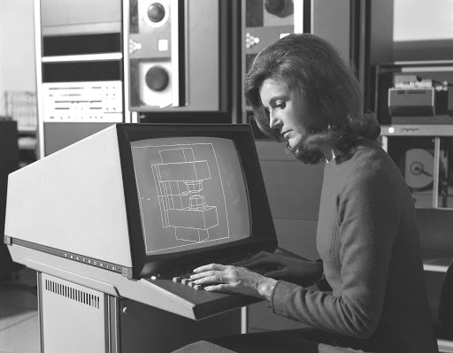

# Silkscreen

## Haskell Application

Generate sites similar to fullPage.js using Markdown

---

## Basics

* Write in markdown language
* Separate slides using three hyphens '---'
* execute `silkscreen filename.md` to generate HTML files
* The background colors are in `config/colors`

---

### You can include images
####  just use markdown syntax

---

# Be

## CREATIVE

---

# :)

## L8rz!

visit [the Adamint @ Pi Place](https://theadamint.com/preview) next!
